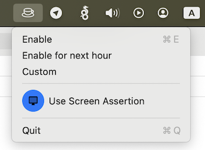

### decaf
Build your `caffeinate` into macOS menu bar.



##### debug
Check enabled assertions:

```bash
pmset -g assertions | grep decaf
   pid 34674(decaf): [0x0001e85800059bbc] 00:00:55 NoDisplaySleepAssertion named: "eyushin - Prevent sleep from decaf"
```
